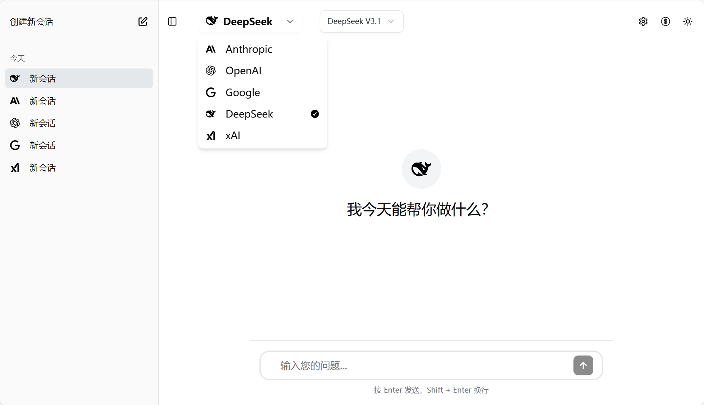
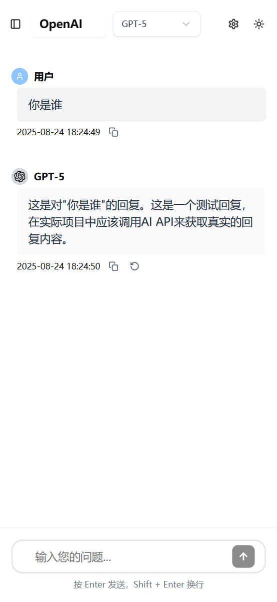
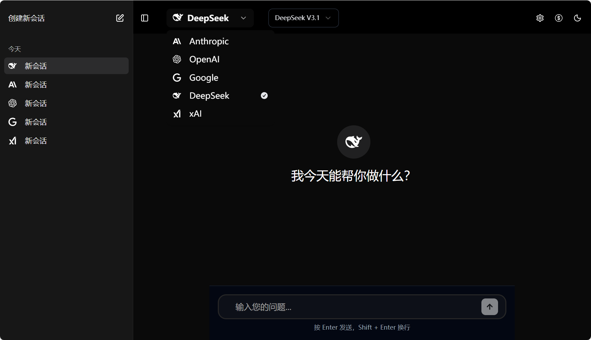
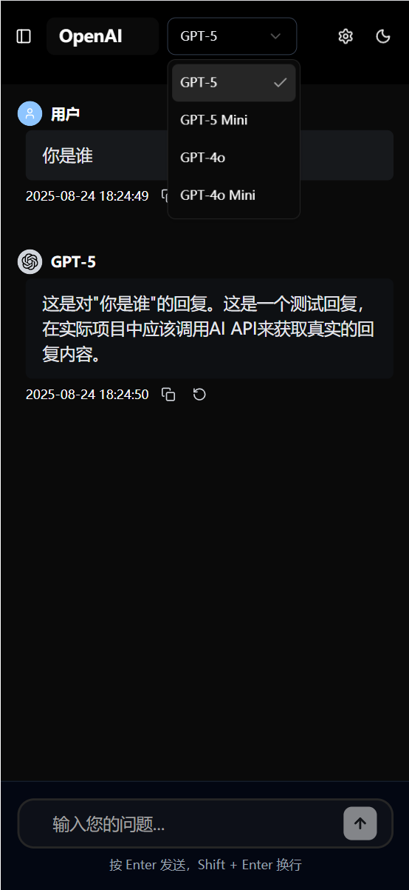
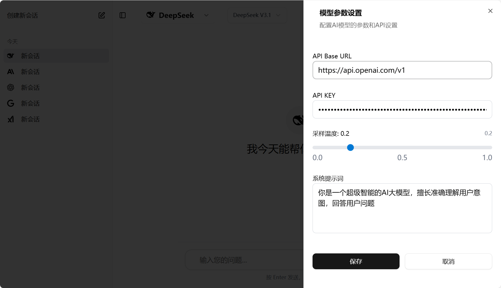
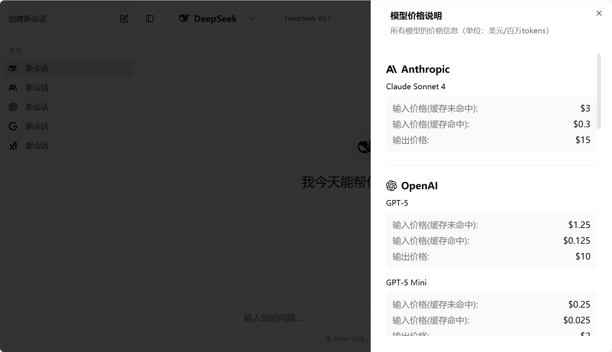

# **空灵智语AI (PureChat)**

厌倦了复杂臃肿的AI聊天界面？试试这个让体验回归纯粹的极简之作——【空灵智语AI (PureChat)】✨

作为用过几乎所有主流AI对话应用的重度用户，包括但不限于Chatbot，CherryStudio，LobeChat，OpenWebUI，ChatGPT-Next-Web，ChatUI，NextChat，我受够了笨重的设计和冗余的功能。终于，我决定自己动手打造一个真正简洁、轻快、专注对话的AI助手！

## 🎯 项目定位

空灵智语AI（PureChat）是一款设计极简、体验纯净的智能对话助手。我们摒弃一切冗余，只为您呈现最直观的界面与最流畅的对话。无需复杂操作，一键开启与AI的深度交流，让思考更专注，让灵感更纯粹。

## ✨ 核心特性

### 🚀 多模型统一接入
- **统一API接口**: 支持OpenAI、Anthropic、Google、DeepSeek、xAI等主流AI服务提供商
- **智能路由**: 自动适配不同厂商的API格式，提供一致的调用体验
- **自定义配置**: 支持自定义API密钥和端点，灵活对接各种AI服务

### 💬 智能会话管理
- **多会话支持**: 创建和管理多个独立对话会话
- **智能分组**: 会话按时间智能分组（今天、昨天、过去30天、月份、年份）
- **持久化存储**: 所有会话数据本地存储，保护隐私安全
- **一键删除**: 支持删除单个会话，保持界面整洁

### 🎨 极致用户体验
- **流式响应**: 实时显示AI回复内容，减少等待时间
- **Markdown渲染**: 完美支持Markdown格式，代码高亮、表格、列表等丰富格式
- **暗色模式**: 完整的深色主题支持，保护眼睛健康
- **响应式设计**: 完美适配桌面端和移动端设备
- **快捷键支持**: Enter发送消息，Shift+Enter换行，Del键删除会话

### 📊 性能监控
- **实时统计**: 显示首字时延、总耗时、输入/输出tokens数量
- **缓存命中**: 显示缓存命中tokens，帮助优化成本
- **性能优化**: 流式传输减少等待时间，提升用户体验

### 🔧 高级功能
- **消息重生成**: 支持重新生成AI回复，获得不同答案
- **内容复制**: 一键复制对话内容到剪贴板
- **系统提示词**: 支持自定义系统角色设定
- **温度调节**: 可调节AI回复的创造性和随机性

## 界面截图

<table>
  <tr>
    <td align="right"></td>
    <td align="left"></td>
  </tr>
  <tr>
    <td align="right"></td>
    <td align="left"></td>
  </tr>
  <tr>
    <td align="center"></td>
  </tr>
  <tr>
    <td align="center"></td>
  </tr>
</table>


## 支持的AI模型

所有模型的价格信息（单位：美元/百万tokens）

### OpenAI模型
| 模型ID | 输入/1M tokens | 缓存命中 | 输出/1M tokens |
|---------|-------|-------------|--------|
| gpt-5 | $1.25 | $0.125 | $10.00 |
| gpt-5-mini | $0.25 | $0.025 | $2.00 |
| gpt-4o | $2.50 | $1.25 | $10.00 |
| gpt-4o-mini | $0.15 | $0.075 | $0.60 |

### Google模型
| 模型ID | 输入/1M tokens | 缓存命中 | 输出/1M tokens |
|---------|-------|-------------|--------|
| gemini-2.5-pro | $1.25 | $0.31 | $10.00 |
| gemini-2.5-flash | $0.30 | $0.075 | $2.50 |

### Anthropic模型
| 模型ID | 输入/1M tokens | 缓存命中 | 输出/1M tokens |
|---------|-------|-------------|--------|
| claude-sonnet-4-20250514 | $3.00 | $0.30 | $15.00 |

### DeepSeek模型
| 模型ID | 输入/1M tokens | 缓存命中 | 输出/1M tokens |
|---------|-------|-------------|--------|
| deepseek-chat | $0.27 | $0.07 | $1.10 |

### xAI模型
| 模型ID | 输入/1M tokens | 缓存命中 | 输出/1M tokens |
|---------|-------|-------------|--------|
| grok-4-0709 | $3.00 | $0.75 | $15.00 |
| grok-3 | $3.00 | $0.75 | $15.00 |
| grok-3-mini | $0.30 | $0.075 | $0.50 |


## 🛠️ 技术架构

### 前端技术栈
- **框架**: [Nuxt 3](https://nuxt.com/) (Vue 3 Composition API)
- **UI组件**: [shadcn/ui](https://ui.shadcn.com/) + Tailwind CSS
- **状态管理**: Vue Composition API + 自定义Composables
- **包管理**: pnpm (高性能包管理器)
- **构建工具**: Vite (快速构建和热重载)

### 后端技术栈
- **服务器框架**: Nuxt Server API (基于Nitro)
- **API标准**: OpenAI兼容API格式
- **流式传输**: Server-Sent Events (SSE)
- **安全防护**: 内置安全头设置，防止XSS和CSRF攻击

### 数据存储
- **本地存储**: localStorage (会话数据持久化)
- **配置文件**: JSON格式模型配置
- **环境配置**: .env文件管理敏感信息

## 📋 开发规范

### 代码风格
- **TypeScript**: 严格模式启用，类型定义优先
- **Vue 3**: 使用组合式API (`<script setup>`语法)
- **组件命名**: PascalCase命名规范
- **代码注释**: 中文注释，包含函数说明和关键逻辑说明

### 组件开发
- **单一职责**: 单个vue文件不超过200行，按功能拆分
- **Props规范**: 必填props不加默认值，可选props必须提供默认值
- **事件命名**: 使用`on`前缀 (如`onClick`)
- **状态管理**: 使用`provide/inject`进行组件间状态共享

### 性能优化
- **流式响应**: 减少用户等待时间
- **虚拟滚动**: 支持大量消息的高性能渲染
- **代码分割**: 按需加载，减少初始包大小
- **缓存策略**: 合理使用浏览器缓存机制


## 后端服务配置

### 环境变量配置

复制 `.env.example` 文件为 `.env` 并配置相应的API密钥：

```bash
# 复制示例配置文件
cp .env.example .env
```

编辑 `.env` 文件，填入实际的API密钥：


### API密钥获取地址, 推荐第三方API聚合服务, 兼容OpenAI API格式

- **O3**: O3速度比较快，官方价格，首字2.5秒左右 https://www.o3.fan
- **CloseAI**: 1.5倍官方价格，首字1.5秒左右 https://platform.closeai-asia.com/
- **UniAPI**: 速度挺快，首字2秒左右 https://uniapi.ai/dashboard
- **智创聚合API**: 首字3秒左右 https://s.lconai.com/

### 🔌 API接口说明

后端提供了符合OpenAI API标准的统一接口，支持所有兼容OpenAI格式的AI服务提供商。

#### 聊天完成接口
**端点**: `POST /api/chat/completions`

**请求体参数**:
```json
{
  "provider": "openai", // 可选，默认使用配置的默认提供商
  "model": "gpt-4o",    // 可选，默认使用配置的默认模型
  "messages": [
    {"role": "system", "content": "你是一个有帮助的助手"},
    {"role": "user", "content": "你好！"}
  ],
  "temperature": 0.3,   // 可选，默认0.3
  "max_tokens": 4096,   // 可选
  "stream": true,       // 可选，是否启用流式传输
  "systemPrompt": "自定义系统提示词", // 可选
  "customApiConfig": {  // 可选，自定义API配置
    "openai": {
      "useCustomApi": true,
      "apiKey": "your-custom-api-key",
      "apiBaseUrl": "https://your-custom-endpoint.com/v1"
    }
  }
}
```


## 本地开发

1. 安装依赖
   ```bash
   pnpm install
   ```

2. 配置环境变量（参考上面的后端服务配置）

3. 启动开发服务器
   ```bash
   pnpm run dev
   ```

4. 打开浏览器访问：http://localhost:3000

## 生产构建

1. 构建前端资源
   ```bash
   pnpm run generate
   ```

2. 构建Web页面
   ```bash
   pnpm run build
   ```

3. 预览Web页面
   ```bash
   pnpm run preview
   ```

## 📁 项目结构

```
PureChat/
├── src/                    # 源代码目录
│   ├── components/         # Vue组件
│   │   ├── ui/            # shadcn/ui基础组件
│   │   ├── AppSidebar.vue # 侧边栏会话管理
│   │   └── MainChat.vue   # 主聊天界面
│   ├── composables/       # Vue组合式函数
│   │   └── useSessions.ts # 会话状态管理
│   ├── data/              # 静态数据
│   │   └── models.json    # 模型配置数据
│   ├── pages/             # 页面路由
│   │   └── index.vue      # 首页
│   ├── server/            # 服务器端代码
│   │   └── api/           # API路由
│   │       └── chat/      # 聊天相关API
│   └── types/             # TypeScript类型定义
├── doc/                   # 文档和截图
├── .env.example          # 环境变量示例
├── components.json       # shadcn/ui组件配置
├── nuxt.config.ts        # Nuxt配置文件
├── package.json          # 项目依赖配置
└── README.md            # 项目说明文档
```

## 🤝 贡献指南

### 开发流程
1. Fork 本仓库
2. 创建特性分支 (`git checkout -b feature/AmazingFeature`)
3. 提交更改 (`git commit -m 'Add some AmazingFeature'`)
4. 推送到分支 (`git push origin feature/AmazingFeature`)
5. 开启 Pull Request

### 代码提交规范
- **feat**: 新功能
- **fix**: 修复bug
- **docs**: 文档更新
- **style**: 代码格式调整
- **refactor**: 代码重构
- **test**: 测试相关
- **chore**: 构建过程或辅助工具的变动

### 测试要求
- 新增功能需要包含相应的单元测试
- 确保所有现有测试通过
- 代码覆盖率不低于80%

## 📄 许可证

本项目采用 MIT 许可证 - 查看 [LICENSE](LICENSE) 文件了解详情

## 🙏 致谢

- [Nuxt.js](https://nuxt.com/) - 全栈Vue框架
- [shadcn/ui](https://ui.shadcn.com/) - 精美的UI组件库
- [Tailwind CSS](https://tailwindcss.com/) - 实用优先的CSS框架
- [OpenAI](https://openai.com/) - 提供强大的AI模型API

## 📞 联系方式

如有问题或建议，请通过以下方式联系：
- 提交 [GitHub Issue](https://github.com/ikiwihome/PureChat/issues)
- 发送邮件至项目维护者

---

⭐ 如果这个项目对您有帮助，请给个Star支持一下！
